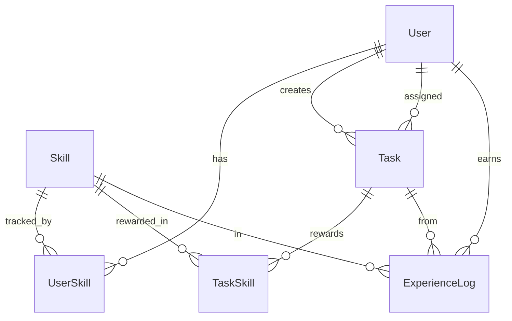

# Схема данных

## Сущности
- **User** — пользователь (username, email, hashed_password, role).
- **Skill** — справочник компетенций.
- **UserSkill** — прогресс пользователя по навыку (experience, level). M:N User↔Skill.
- **Task** — задача (status, difficulty, deadline; creator_id + assignee_id).
- **TaskSkill** — какие навыки прокачивает задача (exp_reward). M:N Task↔Skill.
- **ExperienceLog** — журнал начислений опыта.

## Enum-типы
- `TaskStatus`: todo, in_progress, review, done
- `Difficulty`: 1..5 (валидируется в схемах, хранится как smallint)

## Правило
Изменение модели = миграция Alembic в том же PR.
